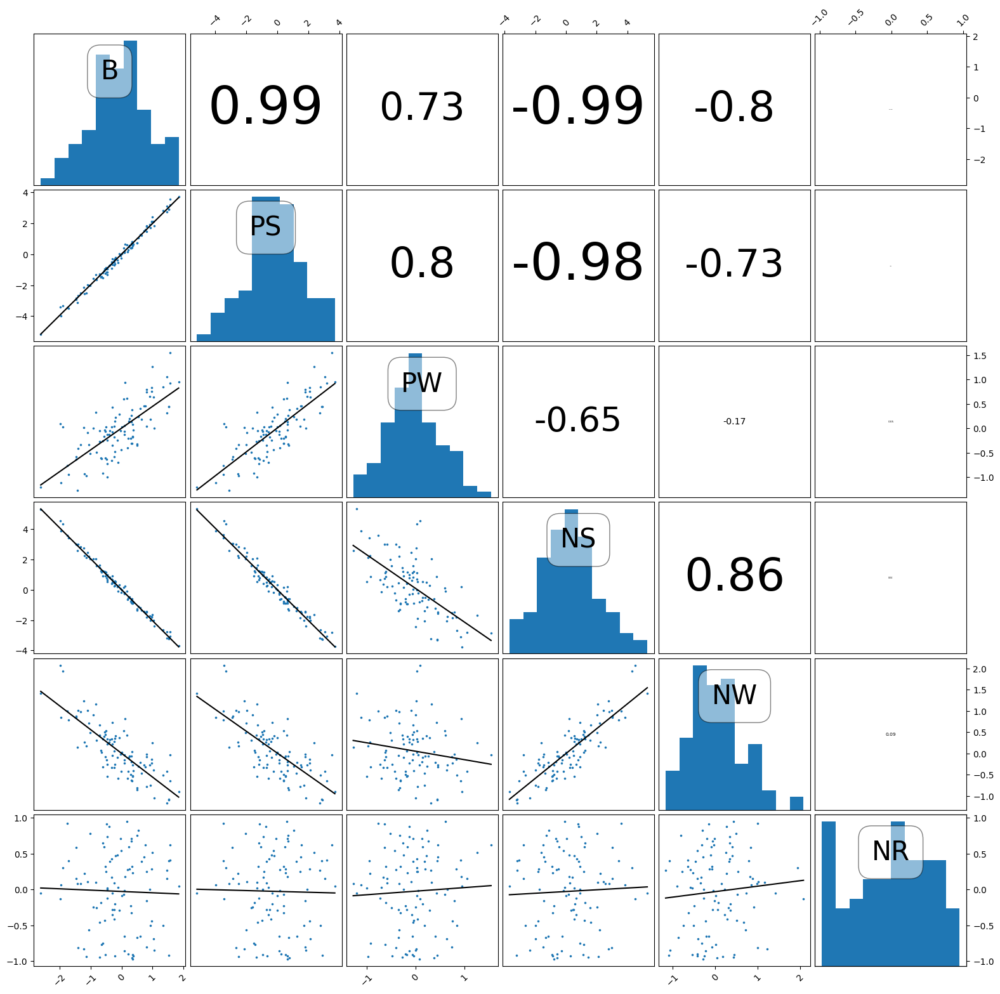

# association-plot

# Association Matrix Visualization

This repository contains a Python function, `association_matrix`, for creating a detailed matrix visualization to explore relationships between pairs of columns in a Pandas DataFrame. The function leverages Matplotlib for plotting, offering a clear and intuitive way to analyze correlations and distributions in datasets.

## Features

- Displays histograms on the diagonal cells to visualize the distribution of individual columns.
- Shows scatter plots with regression lines in the lower triangular cells.
- Displays correlation coefficients in the upper triangular cells, scaled by their magnitude.
- Dynamically adjusts the font size of correlation coefficients for better readability.
- Provides customizable figure size and correlation calculation method (`pearson` or `spearman`).

## Installation

To use the `association_matrix` function, ensure you have the following Python libraries installed:

- `pandas`
- `numpy`
- `matplotlib`

You can install these libraries using pip:

```bash
pip install pandas numpy matplotlib
```

## Usage

Here's how you can use the `association_matrix` function:

```python
import pandas as pd
import numpy as np

from association import association_matrix
import matplotlib.pyplot as plt


np.random.seed(42) 
n = 100

base = np.random.normal(0, 1, n)  
noise = np.random.normal(0, 0.2, n)  

df = pd.DataFrame({
    "B": base,
    "PS": base * 2 + noise,  
    "PW": base * 0.5 + noise * 2,  
    "NS": -base * 2 + noise,  
    "NW": -base * 0.5 + noise * 2,  
    "NR": np.random.uniform(-1, 1, n)  
})

fig, ax = association_matrix(df, method='pearson', figsize=(15, 15))

plt.show()
```





## Parameters

- **df** (`pandas.DataFrame`):
  The input DataFrame containing the data to visualize. All columns must be numeric.

- **method** (`str`, optional):
  The correlation method to use for calculating correlation coefficients. Can be `'pearson'` or `'spearman'`. Default is `'pearson'`.

- **figsize** (`tuple`, optional):
  Specifies the size of the Matplotlib figure. Default is `(15, 15)`.

## Output

- **fig** (`matplotlib.figure.Figure`):
  The Matplotlib figure object for the generated association matrix.

- **ax** (`numpy.ndarray`):
  A 2D array of Axes objects corresponding to the subplots.


## Notes

- Correlation coefficients are rounded to two decimal places and displayed in the upper triangular cells.
- Scatter plots in the lower triangular cells include regression lines.
- Tick positions and labels alternate based on cell position for better readability.
- Histogram bins are fixed at 10, and densities are normalized.

## Example Visualization

The generated association matrix includes:
- Histograms for individual columns along the diagonal.
- Scatter plots with regression lines in the lower triangular cells.
- Correlation coefficients in the upper triangular cells.

## License

This project is licensed under the MIT License. Feel free to use, modify, and distribute it as needed.

